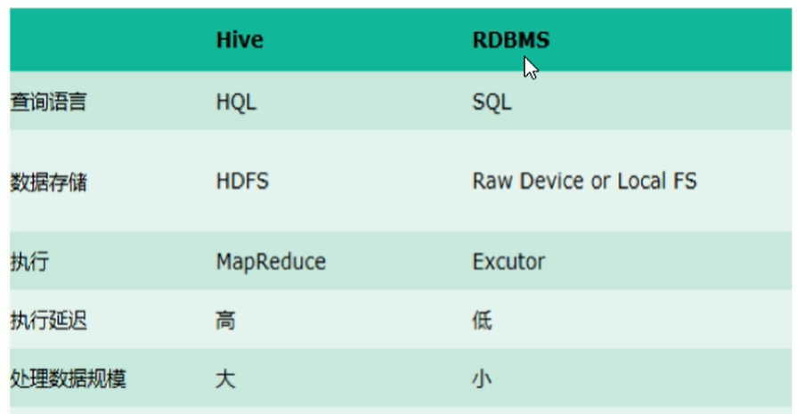

# Hive学习笔记

```
@author: sdubrz
@date: 2020-11-01
本文档为学习B站教程之笔记，原视频网址为 https://www.bilibili.com/video/BV1NT4y1L7kB?from=search&seid=2461235953972148234
```

## 基本概念

### Hive简介

+ Hive本质上是将SQL转化为MapReduce的任务进行计算，底层由HDFS来提供数据存储，说白了Hive可以理解为一个将SQL转换为MapReduce的任务的工具，甚至更进一步可以说Hive就是一个MapReduce的客户端。
+ 为什么使用Hive
  + 采用类SQL的语法去操作数据，提供快速开发的能力。
  + 避免了去屑MapReduce，减少开发人员的学习成本。
  + 功能扩展很方便。

### Hive的架构

### Hive与Hadoop的关系

+ Hive利用HDFS存储数据，利用MapReduce查询分析数据。

  发出类SQL指令-->Hive处理，转换成MapReduce-->提交到Hadoop-->MapReduce运行，HDFS

+ Hive与传统数据库对比

  

+ 

  

  

  

  


