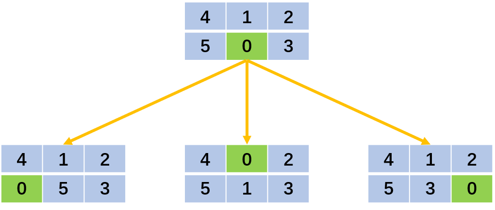

# 滑动谜题

```
@author: sdubrz
@date: 2020.05.26
题号： 773
题目难度： 困难
考察内容： BFS
原题链接 https://leetcode-cn.com/problems/sliding-puzzle/
题目的著作权归领扣网络所有，商业转载请联系官方授权，非商业转载请注明出处。
解题代码转载请联系 lwyz521604#163.com
```

在一个 2 x 3 的板上（``board``）有 5 块砖瓦，用数字 ``1~5`` 来表示, 以及一块空缺用 ``0`` 来表示.

一次移动定义为选择 ``0`` 与一个相邻的数字（上下左右）进行交换.

最终当板 ``board`` 的结果是 ``[[1,2,3],[4,5,0]]`` 谜板被解开。

给出一个谜板的初始状态，返回最少可以通过多少次移动解开谜板，如果不能解开谜板，则返回 -1 。

**示例：**

```
输入：board = [[1,2,3],[4,0,5]]
输出：1
解释：交换 0 和 5 ，1 步完成
```

```
输入：board = [[1,2,3],[5,4,0]]
输出：-1
解释：没有办法完成谜板
```

```
输入：board = [[4,1,2],[5,0,3]]
输出：5
解释：
最少完成谜板的最少移动次数是 5 ，
一种移动路径:
尚未移动: [[4,1,2],[5,0,3]]
移动 1 次: [[4,1,2],[0,5,3]]
移动 2 次: [[0,1,2],[4,5,3]]
移动 3 次: [[1,0,2],[4,5,3]]
移动 4 次: [[1,2,0],[4,5,3]]
移动 5 次: [[1,2,3],[4,5,0]]
```

```
输入：board = [[3,2,4],[1,5,0]]
输出：14
```

**提示：**

+ board 是一个如上所述的 2 x 3 的数组.
+ board[i][j] 是一个 [0, 1, 2, 3, 4, 5] 的排列.

通过次数2,667 提交次数4,553

## BFS解法

一般这种状态变换的最小次数可以用BFS来暴力搜索解决,示意图如下。



为了提高效率，可以用一个 HashSet 来判断某一个状态是否到达过，如果达到过直接剪枝。

具体的实现代码如下：

```
import java.util.*;
class Solution {
    public int slidingPuzzle(int[][] board) {
		int[][] target = {
				{1, 2, 3},
				{4, 5, 0}
		};
		int count = 0;
		if(finished(board, target)) {
			return count;
		}
		int n = board.length;
		int m = board[0].length;
		
		Queue<int[][]> queue1 = new LinkedList<>();
		Queue<Integer> xQueue1 = new LinkedList<>();  // 记录0元素的位置
		Queue<Integer> yQueue1 = new LinkedList<>();  // 
		HashSet<String> set = new HashSet<>();
		queue1.add(board);
		set.add(arrayString(board));
		int[] location = find0(board);
		xQueue1.add(location[0]);
		yQueue1.add(location[1]);
		
		while(!queue1.isEmpty()) {
			count++;
			Queue<int[][]> queue2 = new LinkedList<>();
			while(!queue1.isEmpty()) {
				int[][] root = queue1.poll();
				int x = xQueue1.poll();
				int y = yQueue1.poll();
				
				if(x>0) {  // 和左边的交换
					int[][] leef = new int[n][m];
					for(int i=0; i<n; i++) {
						leef[i] = root[i].clone();
					}
					leef[x][y] = root[x-1][y];
					leef[x-1][y] = root[x][y];
					String str = arrayString(leef);
					if(set.add(str)) {
						if(finished(leef, target)) {
							return count;
						}
						
						queue2.add(leef);
						xQueue1.add(x-1);
						yQueue1.add(y);
					}				
				}
				if(x<n-1) {  // 和右边的交换
					int[][] leef = new int[n][m];
					for(int i=0; i<n; i++) {
						leef[i] = root[i].clone();
					}
					leef[x][y] = root[x+1][y];
					leef[x+1][y] = root[x][y];
					String str = arrayString(leef);
					if(set.add(str)) {
						if(finished(leef, target)) {
							return count;
						}
						
						queue2.add(leef);
						xQueue1.add(x+1);
						yQueue1.add(y);
					}	
				}
				if(y>0) {  // 和上面的交换
					int[][] leef = new int[n][m];
					for(int i=0; i<n; i++) {
						leef[i] = root[i].clone();
					}
					leef[x][y] = root[x][y-1];
					leef[x][y-1] = root[x][y];
					String str = arrayString(leef);
					if(set.add(str)) {
						if(finished(leef, target)) {
							return count;
						}
						
						queue2.add(leef);
						xQueue1.add(x);
						yQueue1.add(y-1);
					}	
				}
				if(y<m-1) {  // 和下面的交换
					int[][] leef = new int[n][m];
					for(int i=0; i<n; i++) {
						leef[i] = root[i].clone();
					}
					leef[x][y] = root[x][y+1];
					leef[x][y+1] = root[x][y];
					String str = arrayString(leef);
					if(set.add(str)) {
						if(finished(leef, target)) {
							return count;
						}
						
						queue2.add(leef);
						xQueue1.add(x);
						yQueue1.add(y+1);
					}	
				}
			}
			
			queue1 = queue2;
			
		}
		
		return -1;
    }
	
	// 判断是否是最终的结果
	private boolean finished(int[][] array, int[][] target) {
		for(int i=0; i<target.length; i++) {
			for(int j=0; j<target[i].length; j++) {
				if(array[i][j]!=target[i][j]) {
					return false;
				}
			}
		}
		return true;
	}
	
	// 将数组转化为字符串，方便做Hash
	private String arrayString(int[][] array) {
		String str = "";
		for(int i=0; i<array.length; i++) {
			for(int j=0; j<array[i].length; j++) {
				str = str + array[i][j];
			}
		}
		return str;
	}
	
	// 寻找0元素的位置
	private int[] find0(int[][] array) {
		int x = -1;
		int y = -1;
		for(int i=0; i<array.length; i++) {
			for(int j=0; j<array[i].length; j++) {
				if(array[i][j]==0) {
					x = i;
					y = j;
					break;
				}
			}
			if(x>=0) {
				break;
			}
		}
		int[] result = {x, y};
		
		return result;
	}

}
```

在 LeetCode 系统中提交的结果如下所示

```
执行结果： 通过 显示详情
执行用时 : 35 ms, 在所有 Java 提交中击败了 13.85% 的用户
内存消耗 : 40.3 MB, 在所有 Java 提交中击败了 100.00% 的用户
```

## 其他方法

这个题其实就是在人工智能课上学过的八数码问题。可以有多种解决方法，如动态规划、A* 算法、BFS、DFS等。因为BFS思路和代码都比较简单，所以我先用BFS来尝试的。其实 A* 算法的效率要优于BFS。有时间会在这里进行补充。