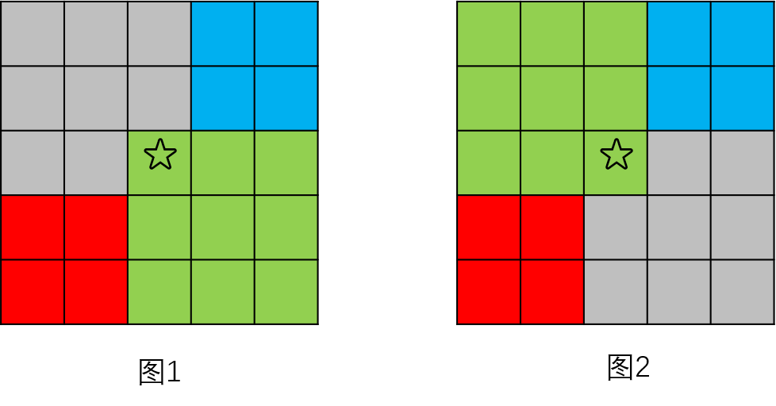

# 二维数组中的查找

```
@author: sdubrz
@date: 2020.05.02
@e-mail: lwyz521604#163.com
题目来自《剑指offer》 电子工业出版社
```

在一个 n * m 的二维数组中，每一行都按照从左到右递增的顺序排序，每一列都按照从上到下递增的顺序排序。请完成一个函数，输入这样的一个二维数组和一个整数，判断数组中是否含有该整数。

**示例:**

现有矩阵 matrix 如下：

```
[
  [1,   4,  7, 11, 15],
  [2,   5,  8, 12, 19],
  [3,   6,  9, 16, 22],
  [10, 13, 14, 17, 24],
  [18, 21, 23, 26, 30]
]
```
给定 target = 5，返回 true。

给定 target = 20，返回 false。

 

**限制：**

+ 0 <= n <= 1000

+ 0 <= m <= 1000

## 我的解法

对于给定的一个二维数组，根据题意，其最小值和最大值肯定分别在数组的开头和末尾，我们可以根据这个来初步判断目标数值是否有可能在这个数组中出现。如果有可能，则可以使用二分法进行查找。

比较数组中间位置元素与目标数值的大小，图1表示了比目标数值小的情况，图2表示了比目标数值大的情况。根据不同的情况，分别去继续探索红色、蓝色和绿色的区域。如此递归的实现。



下面是具体给出的Java程序实现。

```
class Solution {
    	public boolean findNumberIn2DArray(int[][] matrix, int target) {
		if(matrix.length==0) {
			return false;
		}
		int m = matrix[0].length;
		if(m==0) {
			return false;
		}
		
		return this.find2d(matrix, target, 0, matrix.length-1, 0, m-1);
	}
	
	/**
	 * 在矩阵中的一个矩形区域内查找是否含有目标数值
	 * @param matrix 矩阵
	 * @param target 要查找的数值
	 * @param left 矩形区域的最左边
	 * @param right 矩形区域的最右边
	 * @param up 矩形区域的最上方
	 * @param bottom 矩形区域的最下方
	 * @return
	 */
	private boolean find2d(int[][] matrix, int target, int up, int bottom, int left, int right) {
		if(left==right && up==bottom) {
			return matrix[up][left]==target;
		}
		
		if(matrix[up][left]>target) {
			return false;
		}
		
		if(matrix[bottom][right]<target) {
			return false;
		}
		
		// 如果范围比较小，直接查找
		if(bottom-up<4 && right-left<4) {
			for(int i=up; i<=bottom; i++) {
				for(int j=left; j<=right; j++) {
					if(matrix[i][j]==target) {
						return true;
					}
				}
			}
			return false;
		}
		
		// 用二分法
		int col_m = (left+right)/2;
		int row_m = (up+bottom)/2;
		
		if(matrix[row_m][col_m]==target) {
			return true;
		}
		
		if(matrix[row_m][col_m]<target) {
			boolean temp = this.find2d(matrix, target, row_m, bottom, col_m, right);
			if(temp) {
				return true;
			}
			
//			if(row_m<bottom) {
//				temp = this.find2d(matrix, target, row_m+1, bottom, col_m, col_m);
//				if(temp) {
//					return true;
//				}
//			}
			
			if(row_m<bottom && col_m>left) {
				temp = this.find2d(matrix, target, row_m+1, bottom, left, col_m-1);
				if(temp) {
					return true;
				}
			}
			if(row_m>up && col_m<right) {
				temp = this.find2d(matrix, target, up, row_m-1, col_m+1, right);
				if(temp) {
					return true;
				}
			}
		}
		
		if(matrix[row_m][col_m]>target) {
			boolean temp = this.find2d(matrix, target, up, row_m, left, col_m);
			if(temp) {
				return temp;
			}
			if(row_m<bottom && col_m>left) {
				temp = this.find2d(matrix, target, row_m+1, bottom, left, col_m-1);
				if(temp) {
					return true;
				}
			}
			if(row_m>up && col_m<right) {
				temp = this.find2d(matrix, target, up, row_m-1, col_m+1, right);
				if(temp) {
					return temp;
				}
			}
		}
		
		
		return false;
	}
}
```

在 LeetCode 系统中提交的结果如下

```
执行结果： 通过 显示详情
执行用时 : 0 ms, 在所有 Java 提交中击败了 100.00% 的用户
内存消耗 : 45.7 MB, 在所有 Java 提交中击败了 100.00% 的用户
```

## 官方给出的线性解法

下面是官方给出的一种线性时间复杂度的方法。


```
class Solution {
    public boolean findNumberIn2DArray(int[][] matrix, int target) {
        if (matrix == null || matrix.length == 0 || matrix[0].length == 0) {
            return false;
        }
        int rows = matrix.length, columns = matrix[0].length;
        int row = 0, column = columns - 1;
        while (row < rows && column >= 0) {
            int num = matrix[row][column];
            if (num == target) {
                return true;
            } else if (num > target) {
                column--;
            } else {
                row++;
            }
        }
        return false;
    }
}
```

相比较而言，官方的算法代码实现上要稍微更加优美一点。

