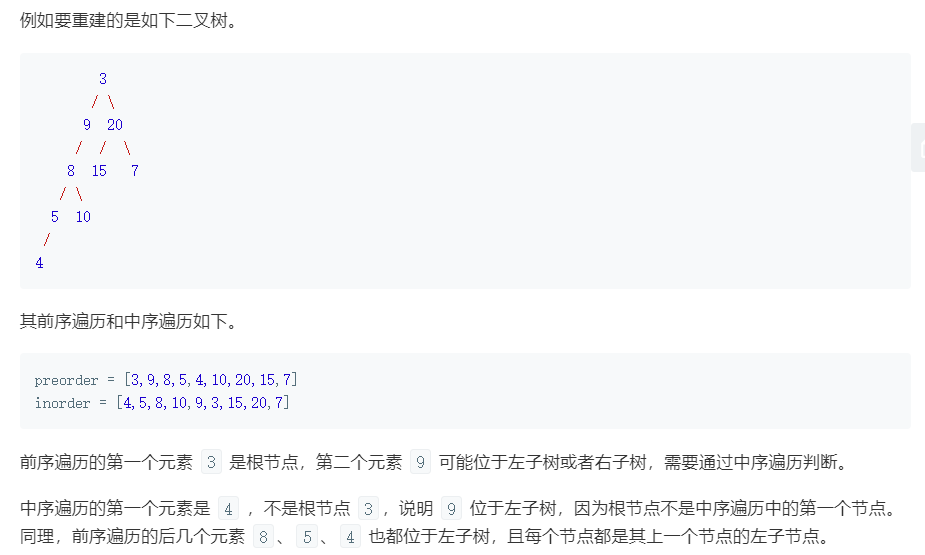
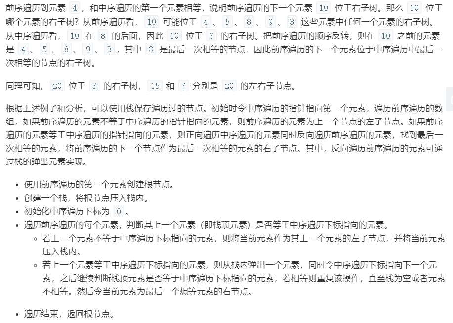

# 重建二叉树

```
@author: sdubrz
@date: 2020.05.03
@e-mail: lwyz521604#163.com
题目来自《剑指offer》 电子工业出版社
```

输入某二叉树的前序遍历和中序遍历的结果，请重建该二叉树。假设输入的前序遍历和中序遍历的结果中都不含重复的数字。

例如，给出

```
前序遍历 preorder = [3,9,20,15,7]
中序遍历 inorder = [9,3,15,20,7]
```

返回如下的二叉树：

```
    3
   / \
  9  20
    /  \
   15   7
``` 

限制：

``0 <= 节点个数 <= 5000``

## 我的解法

对于一颗二叉树，其前序遍历中第一个元素必然是根节点，并且左子树的元素位于右子树元素的前面。而在中序遍历中，左子树的元素均位于根节点元素的前面，右子树的元素均位于根节点元素的后面。下图表示了这一位置关系，其中红色元素为根节点，绿色的为左子树中的元素，蓝色的为右子树中的元素。


根据这一位置关系，我们可以写出递归的解决方案，下面是具体的Java代码实现。

```
/**
 * Definition for a binary tree node.
 * public class TreeNode {
 *     int val;
 *     TreeNode left;
 *     TreeNode right;
 *     TreeNode(int x) { val = x; }
 * }
 */
class Solution {
    public TreeNode buildTree(int[] preorder, int[] inorder) {
        if(preorder.length==0){
            return null;
        }
        int n = preorder.length;
        TreeNode  root = this.buildTree(preorder, inorder, 0, n-1, 0, n-1);
        return root;
    }

    private TreeNode buildTree(int[] preorder, int[] inorder, int preHead, int preTail, int inHead, int inTail){
        if(preHead==preTail){ // 只有一个节点
            TreeNode node = new TreeNode(preorder[preHead]);
            return node;
        }

        TreeNode root = new TreeNode(preorder[preHead]);
        int rootIndex = -1;
        for(int i=inHead; i<=inTail; i++){
            if(inorder[i]==preorder[preHead]){
                rootIndex = i;
                break;
            }
        }
        
        int leftSize = rootIndex - inHead;  // 左子树节点数
        int rightSize = inTail - rootIndex;  // 右子树节点数
        if(leftSize>0){
            root.left = this.buildTree(preorder, inorder, preHead+1, preHead+leftSize, inHead, rootIndex-1);
        }
        if(rightSize>0){
            root.right = this.buildTree(preorder, inorder, preHead+leftSize+1, preTail, rootIndex+1, inTail);
        }
        return root;
    }

}
```

在 LeetCode 系统中提交的结果如下

```
执行结果： 通过 显示详情
执行用时 : 4 ms, 在所有 Java 提交中击败了 60.63% 的用户
内存消耗 : 40.1 MB, 在所有 Java 提交中击败了 100.00% 的用户
```

## 官方递归解法

LeetCode 的题解中官方给出了递归和迭代两种解法。其中，递归解法的思路与我的一致，不过代码的实现略有不同。下面是官方给出的递归解法的Java代码。

```
/**
 * Definition for a binary tree node.
 * public class TreeNode {
 *     int val;
 *     TreeNode left;
 *     TreeNode right;
 *     TreeNode(int x) { val = x; }
 * }
 */
class Solution {
    public TreeNode buildTree(int[] preorder, int[] inorder) {
        if (preorder == null || preorder.length == 0) {
            return null;
        }
        Map<Integer, Integer> indexMap = new HashMap<Integer, Integer>();
        int length = preorder.length;
        for (int i = 0; i < length; i++) {
            indexMap.put(inorder[i], i);
        }
        TreeNode root = buildTree(preorder, 0, length - 1, inorder, 0, length - 1, indexMap);
        return root;
    }

    public TreeNode buildTree(int[] preorder, int preorderStart, int preorderEnd, int[] inorder, int inorderStart, int inorderEnd, Map<Integer, Integer> indexMap) {
        if (preorderStart > preorderEnd) {
            return null;
        }
        int rootVal = preorder[preorderStart];
        TreeNode root = new TreeNode(rootVal);
        if (preorderStart == preorderEnd) {
            return root;
        } else {
            int rootIndex = indexMap.get(rootVal);
            int leftNodes = rootIndex - inorderStart, rightNodes = inorderEnd - rootIndex;
            TreeNode leftSubtree = buildTree(preorder, preorderStart + 1, preorderStart + leftNodes, inorder, inorderStart, rootIndex - 1, indexMap);
            TreeNode rightSubtree = buildTree(preorder, preorderEnd - rightNodes + 1, preorderEnd, inorder, rootIndex + 1, inorderEnd, indexMap);
            root.left = leftSubtree;
            root.right = rightSubtree;
            return root;
        }
    }
}
```

由于使用了一个Map来存储中序遍历中每个元素与其索引的对应关系，因而在查找节点位置时，官方代码要比我的代码更快一些。

```
执行结果： 通过 显示详情
执行用时 : 3 ms, 在所有 Java 提交中击败了 81.16% 的用户
内存消耗 : 39.8 MB, 在所有 Java 提交中击败了 100.00% 的用户
```

## 官方迭代解法





```
/**
 * Definition for a binary tree node.
 * public class TreeNode {
 *     int val;
 *     TreeNode left;
 *     TreeNode right;
 *     TreeNode(int x) { val = x; }
 * }
 */
class Solution {
    public TreeNode buildTree(int[] preorder, int[] inorder) {
        if (preorder == null || preorder.length == 0) {
            return null;
        }
        TreeNode root = new TreeNode(preorder[0]);
        int length = preorder.length;
        Stack<TreeNode> stack = new Stack<TreeNode>();
        stack.push(root);
        int inorderIndex = 0;
        for (int i = 1; i < length; i++) {
            int preorderVal = preorder[i];
            TreeNode node = stack.peek();
            if (node.val != inorder[inorderIndex]) {
                node.left = new TreeNode(preorderVal);
                stack.push(node.left);
            } else {
                while (!stack.isEmpty() && stack.peek().val == inorder[inorderIndex]) {
                    node = stack.pop();
                    inorderIndex++;
                }
                node.right = new TreeNode(preorderVal);
                stack.push(node.right);
            }
        }
        return root;
    }
}

```

下面是在 LeetCode 系统中提交的结果

```
执行结果： 通过 显示详情
执行用时 : 3 ms, 在所有 Java 提交中击败了 81.16% 的用户
内存消耗 : 39.6 MB, 在所有 Java 提交中击败了 100.00% 的用户
```

由于每个元素都需要一次新建节点的过程，所以这三种方法的时间复杂度均为 $O(n)$。