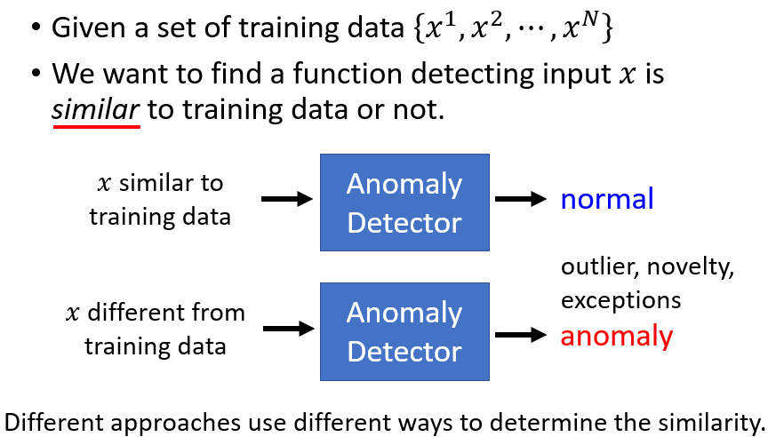
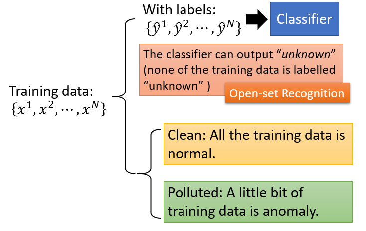
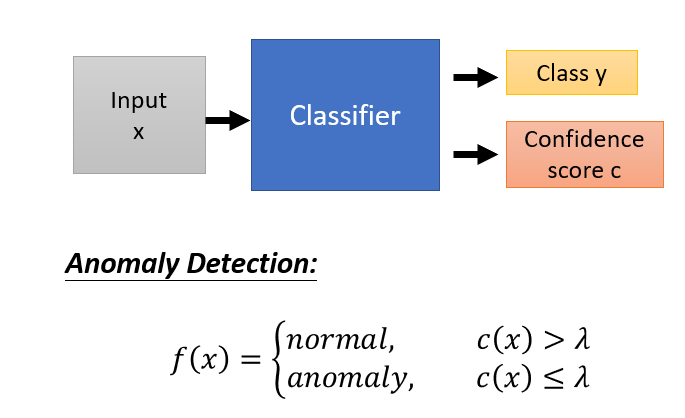

# Anomaly Detection

```
@author: sdubrz
@date: 2020.05.16
学习李宏毅老师深度学习课程的笔记
```

## 简介

**异常检测**，就是让机器在不知道的时候知道自己不知道。如下图所示，当输入一个 x ,当这个 x 与训练数据不相似的时候，能够判断出异常。



## 应用

+ Fraud Detection
	+ 正常刷卡行为 VS. 盗刷
+ Network Intrusion Detection
	+ 正常连接 VS. 攻击行为
+ Cancer Detection
	+ 正常细胞 VS. 癌细胞
	
## 问题分类

下图是 Anomaly Detection 问题的几种情况分类。



## Case 1： With Classifier

基本思想是在分类的同时，输出一个信息程度，当信息程度低于某个阈值时，判定为异常的。



## Without Labels

