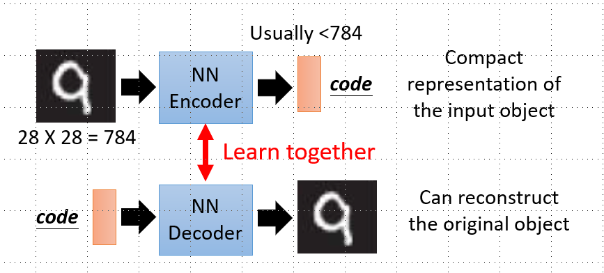

# Unsupervised Learning

## Linear Methods

```
@author: sdubrz
@date: 2020.05.11
@e-mail: lwyz521604@163.com
本文是学习李宏毅老师深度学习系列课程的笔记。
```

### clustering

+ k-means
+ Hiearchical Agglomerative Clustering(HAC) 就是层次聚类

### Dimension Reduction

+ Feature selection
+ Principle component analysis(PCA)
	相关公式推导可见 PRML

### Linear Dimension Reduction

### Matrix Factorization

可以用于推荐系统。

也可用于拓扑分析。

## Neighbor Embedding

由于对这部分比较熟悉，所以不再详细记录。

+ LLE
+ Laplacian Eiginmaps
+ t-SNE

## Deep Auto-encoder

如下图所示，一个网络是把图片转化为code，另一个网络是把code转化为图片。单独的话，这两个网络都无法训练，但是可以把它们接起来，用第一个网络的输出做为第二个网络的输入。让第一个网络输入的图片与第二个网络输出的图片相同。这样就可以训练了。


## Generation

详细的介绍可以参考[https://openai.com/blog/generative-models/](https://openai.com/blog/generative-models/)

下面是常用的三个models：
+ PixelRNN
+ Variational Autoencoder(VAE)
+ Generative Adversarial Network(GAN)

使用VAE生成图片，有点像是对数据集里面的某些图片做了一个线性的混合，并没有去真正地学取如何生成一个可以以假乱真的图片。