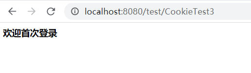

# Cookie和Session

```
@author: sdubrz
@date: 2020-10-26
```

Cookie和Session是实现会话机制的工具，其中Cookie是客户端浏览器的，而Session是服务器端的。

## 一个Cookie的简单例子

+ 新建一个Cookie:

  ```java
  import javax.servlet.ServletException;
  import javax.servlet.annotation.WebServlet;
  import javax.servlet.http.Cookie;
  import javax.servlet.http.HttpServlet;
  import javax.servlet.http.HttpServletRequest;
  import javax.servlet.http.HttpServletResponse;
  import java.io.IOException;
  
  @WebServlet("/CookieTest1")
  public class CookieTest1 extends HttpServlet {
      protected void doPost(HttpServletRequest request, HttpServletResponse response) throws ServletException, IOException {
          Cookie cookie = new Cookie("msg", "HelloCookie");
          response.addCookie(cookie);  // 发送Cookie
      }
  
      protected void doGet(HttpServletRequest request, HttpServletResponse response) throws ServletException, IOException {
          this.doPost(request, response);
      }
  }
  ```

+ 接收Cookie，并在控制台打印

  ```java
  import javax.servlet.ServletException;
  import javax.servlet.annotation.WebServlet;
  import javax.servlet.http.Cookie;
  import javax.servlet.http.HttpServlet;
  import javax.servlet.http.HttpServletRequest;
  import javax.servlet.http.HttpServletResponse;
  import java.io.IOException;
  
  @WebServlet("/CookieTest2")
  public class CookieTest2 extends HttpServlet {
      protected void doPost(HttpServletRequest request, HttpServletResponse response) throws ServletException, IOException {
          Cookie[] cookies = request.getCookies();
          if(cookies != null){
              for(Cookie c : cookies){  // 打印接收到的Cookie
                  String name = c.getName();
                  String value = c.getValue();
                  System.out.println(name + ": "+value);
              }
          }
      }
  
      protected void doGet(HttpServletRequest request, HttpServletResponse response) throws ServletException, IOException {
          this.doPost(request, response);
      }
  }
  
  ```

## 用Cookie记录用户上一次访问的时间

如果用户是首次访问，则在网页上显示“欢迎首次访问”，如果不是首次访问，则显示用户上次访问的时间。下面是具体的程序实现，注意其中用到了URL编码和解码以支持空格等特殊字符。

```java
import javax.servlet.ServletException;
import javax.servlet.annotation.WebServlet;
import javax.servlet.http.Cookie;
import javax.servlet.http.HttpServlet;
import javax.servlet.http.HttpServletRequest;
import javax.servlet.http.HttpServletResponse;
import java.io.IOException;
import java.io.UnsupportedEncodingException;
import java.net.URLDecoder;
import java.net.URLEncoder;
import java.text.DateFormat;
import java.text.SimpleDateFormat;
import java.util.Date;

@WebServlet("/CookieTest3")
public class CookieTest3 extends HttpServlet {

    private final int MAX_AGE = 60*60*24*30;

    protected void doPost(HttpServletRequest request, HttpServletResponse response) throws ServletException, IOException {
        response.setContentType("text/html;charset=utf-8");

        // 获取Cookie
        Cookie[] cookies = request.getCookies();
        Boolean first = true;
        if(cookies!=null && cookies.length>0){
            for(Cookie ck : cookies){
                String name = ck.getName();
                if("lastVisit".equals(name)){
                    first = false;

                    String lastValue = ck.getValue();
                    lastValue = URLDecoder.decode(lastValue, "utf-8");  // URL解码
                    response.getWriter().write("<h3>欢迎回来，您上次访问的时间为 "+lastValue+"</h3>");
                    response.addCookie(updateTime(ck));
                    break;
                }
            }
        }
        if(first){  // 首次登录
            Cookie ck = new Cookie("lastVisit", "");
            response.addCookie(updateTime(ck));
            response.getWriter().write("<h3>欢迎首次登录</h3>");
        }
    }

    protected void doGet(HttpServletRequest request, HttpServletResponse response) throws ServletException, IOException {
        this.doPost(request, response);
    }

    private Cookie updateTime(Cookie cookie) throws UnsupportedEncodingException {
        Date date = new Date();
        SimpleDateFormat sdf = new SimpleDateFormat("yyyy年MM月dd日 hh:mm:ss");
        String str_date = sdf.format(date);
        str_date = URLEncoder.encode(str_date, "utf-8");  // URL编码以支持空格等特殊字符
        cookie.setValue(str_date);
        cookie.setMaxAge(MAX_AGE);
        return cookie;
    }
}

```

第一次访问CookieTest3的结果如下：



第二次访问CookieTest3的结果如下

