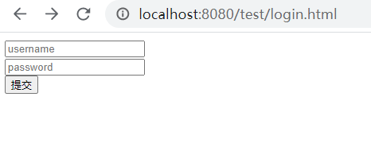
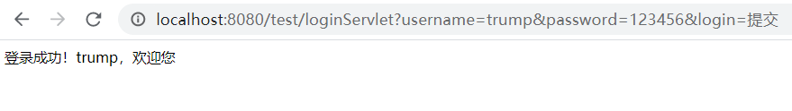

# 用servlet实现简单的登录

```
@date: 2020-10-20
本文是学习传智黑马Java视频的笔记
```

## 0 需求分析

+ 在数据库中建一个用户信息表
+ 当用户在表单中输入登录信息并提交之后，在数据库中查找是否有该用户
  + 如果该用户存在，返回该用户的完整信息，并在网页上输出欢迎词。
  + 如果该用户不存在，在网页端显示“用户名或密码错误”。

## 1 基础类

我们首先来建立一个用户类，来存放用户信息。

```java
package brz.learn.itcast.domain;

/**
 * 用户类
 */
public class User {
    private int id;
    private String username;
    private String password;

    public void setId(int id) {
        this.id = id;
    }

    public void setUsername(String username) {
        this.username = username;
    }

    public void setPassword(String password) {
        this.password = password;
    }

    public int getId() {
        return id;
    }

    public String getUsername() {
        return username;
    }

    public String getPassword() {
        return password;
    }


}
```

## 2 数据库相关部分

### 2.1 准备MySQL中的数据库

在MySQL数据库中新建一个存储用户信息的 ``users`` 表：

```mysql
create table users(
	id int primary key auto_increment,
	username varchar(30) unique not null,
	password varchar(30) not null
);
```

并向其中插入两条临时数据：

```mysql
insert into users(username, password) values('trump', '123456');
insert into users(username, password) values('biden', 'abandon');
```

此时 ``users``表中的信息为

```
+----+----------+----------+
| id | username | password |
+----+----------+----------+
|  1 | trump    | 123456   |
|  2 | biden    | abandon  |
+----+----------+----------+
```

### 2.2 设置配置文件

这里，我们将配置文件命名为 ``druid.properties``，其内容如下所示，其中第二行为所用的数据库名字。

```
driverClassName=com.mysql.jdbc.Driver
url=jdbc:mysql:///javaweb
username=root
password=root
initialSize=5
maxActive=10
maxWait=3000
```

### 2.3 测试连接数据库

```java
package brz.learn.itcast.dao;

import brz.learn.itcast.domain.User;
import brz.learn.itcast.utils.JDBCUtils;
import org.springframework.dao.DataAccessException;
import org.springframework.jdbc.core.BeanPropertyRowMapper;
import org.springframework.jdbc.core.JdbcTemplate;

public class UserDao {

    // 声明JDBCTemplate对象共享
    private JdbcTemplate template = new JdbcTemplate(JDBCUtils.getDataSource());

    /**
     * 登录方法
     * @param loginUser 只有用户名和密码
     * @return user 包含用户全部数据
     */
    public User login(User loginUser){
        try {
            // 编写 SQL
            String sql = "select * from users where username = ? and password= ? ";
            // 调用query方法
            User user = template.queryForObject(sql,
                    new BeanPropertyRowMapper<User>(User.class),
                    loginUser.getUsername(), loginUser.getPassword());
            return user;
        }catch(DataAccessException e){
            return null;
        }
    }

    public static void main(String[] args) {
        User user = new User();
        user.setUsername("trump");
        user.setPassword("123456");
        UserDao obj = new UserDao();
        User returnUser = obj.login(user);
        if(returnUser==null){
            System.out.println("查询结果为空");
        }else{
            System.out.println("查询成功");
            System.out.println(returnUser);
        }
    }
}
```

## 3 登录表单

```html
<!DOCTYPE html>
<html lang="en">
<head>
    <meta charset="UTF-8">
    <title>登录</title>
</head>
<body>
    <form action="/test/loginServlet" method="get">
        <input type="text" placeholder="username" name="username"><br>
        <input type="password" placeholder="password" name="password"><br>
        <input type="submit" name="login">
    </form>
</body>
</html>
```

界面比较简陋，效果如下所示



## 4 Servlet编写

### 4.1 LoginServlet

```java
package brz.learn.itcast.web.servlet;

import brz.learn.itcast.dao.UserDao;
import brz.learn.itcast.domain.User;

import javax.servlet.ServletException;
import javax.servlet.annotation.WebServlet;
import javax.servlet.http.HttpServlet;
import javax.servlet.http.HttpServletRequest;
import javax.servlet.http.HttpServletResponse;
import java.io.IOException;

@WebServlet("/loginServlet")
public class LoginServlet extends HttpServlet {

    @Override
    protected void doGet(HttpServletRequest req, HttpServletResponse resp) throws ServletException, IOException {
        // 设置编码
        req.setCharacterEncoding("utf-8");
        // 设置请求参数
        String username = req.getParameter("username");
        String password = req.getParameter("password");
        // 封装User对象
        User loginUser = new User();
        loginUser.setUsername(username);
        loginUser.setPassword(password);

        // 调用UserDao的login方法
        UserDao dao = new UserDao();
        User user = dao.login(loginUser);

        // 判断user
        if(user==null){  // 登录失败
            req.getRequestDispatcher("/failServlet").forward(req, resp);
        }else{  // 登录成功
            // 存储数据
            req.setAttribute("user", user);
            // 转发
            req.getRequestDispatcher("/successServlet").forward(req, resp);
        }
    }

    @Override
    protected void doPost(HttpServletRequest req, HttpServletResponse resp) throws ServletException, IOException {
        //super.doPost(req, resp);
        this.doGet(req, resp);
    }
}

```

### 4.2 FailServlet

当登录失败时候的处理

```java
package brz.learn.itcast.web.servlet;

import javax.servlet.ServletException;
import javax.servlet.annotation.WebServlet;
import javax.servlet.http.HttpServlet;
import javax.servlet.http.HttpServletRequest;
import javax.servlet.http.HttpServletResponse;
import java.io.IOException;

@WebServlet("/failServlet")
public class FailServlet extends HttpServlet {
    protected void doPost(HttpServletRequest request, HttpServletResponse response) throws ServletException, IOException {
        // 设置编码
        response.setContentType("text/html;charset=utf-8");
        // 输出
        response.getWriter().write("登录失败，用户名或密码错误");
    }

    protected void doGet(HttpServletRequest request, HttpServletResponse response) throws ServletException, IOException {
        this.doPost(request, response);
    }
}

```

### 4.3 SuccessServlet

当登录成功时的处理

```java
package brz.learn.itcast.web.servlet;

import brz.learn.itcast.domain.User;

import javax.servlet.ServletException;
import javax.servlet.annotation.WebServlet;
import javax.servlet.http.HttpServlet;
import javax.servlet.http.HttpServletRequest;
import javax.servlet.http.HttpServletResponse;
import java.io.IOException;

@WebServlet("/successServlet")
public class SuccessServlet extends HttpServlet {
    protected void doPost(HttpServletRequest request, HttpServletResponse response) throws ServletException, IOException {
        // 获取request域中共享的user对象
        User user = (User) request.getAttribute("user");
        if(user!=null){
            // 设置编码
            response.setContentType("text/html;charset=utf-8");
            // 输出
            response.getWriter().write("登录成功！"+user.getUsername()+"，欢迎您");
        }
    }

    protected void doGet(HttpServletRequest request, HttpServletResponse response) throws ServletException, IOException {
        this.doPost(request, response);
    }
}

```

## 5 效果展示

输入 

```
trump
123456
```

提交结果为



输入

```
trump
abandon
```

提交结果为

